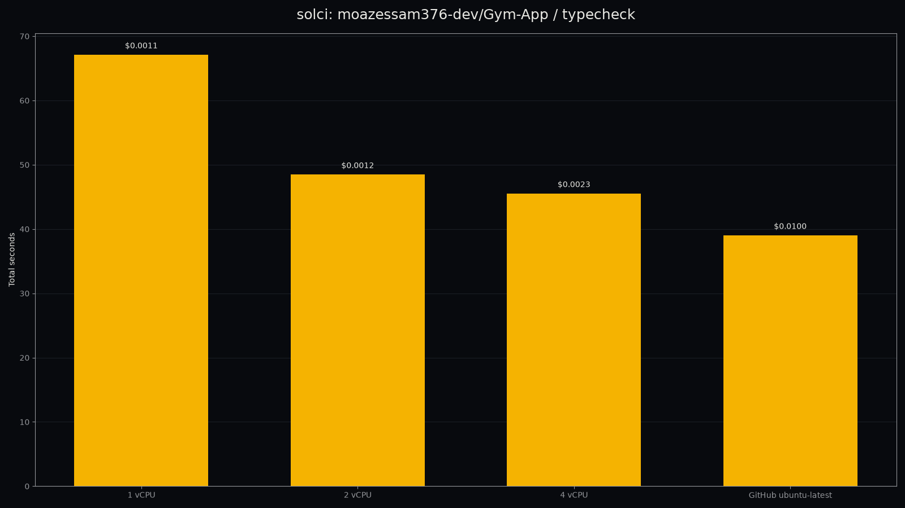

# solari-ci

Right-size a GitHub Actions job with evidence from Solari microVMs: speed, cost, history, and actionable findings.



## What it does

- Inspects workflow shape, matrix cells, runner labels, history, and static findings.
- Runs one selected Linux job natively in isolated Solari microVMs at several CPU sizes.
- Renders a speed-versus-cost curve as terminal output, Markdown, JSON, and an optional PNG.

## Why

GitHub's Actions platform fee is $0.002/minute effective 2026-03-01, and right-sizing with evidence makes
the trade-off between wall-clock time and compute cost visible before changing a workflow. The
evidence-first framing is inspired by Blacksmith's [code]smith CI Tuning.

## Install

```bash
uv pip install -e .
cp .env.example .env
```

Set `SOLARI_API_KEY` in `.env` and log in with `gh auth login`. `GITHUB_TOKEN` (or the output of
`gh auth token`) lets solci clone private repositories inside the sandbox; the token is injected into the
clone URL inside the microVM and masked in logs. For example, `export GITHUB_TOKEN=$(gh auth token)` also
helps the `gh` CLI avoid GitHub API rate limits; never paste it into reports.

## Usage

Check the local setup:

```bash
solci doctor
```

```text
▮ SOLCI /// DOCTOR  check this Solari setup
  CHECK             STATUS    DETAIL
  SOLARI_API_KEY    PASS      slr_live_...xxxx
  gh auth           PASS      authenticated
  Solari sandbox    PASS      create -> nproc=1 -> delete in 2.66s
```

Inspect a remote repository:

```bash
solci inspect moazessam376-dev/crosstalk
```

```text
◎ moazessam376-dev/crosstalk
WORKFLOWS / JOBS
  WORKFLOW    JOB ID  RUNS-ON            STEPS  MATRIX  SERVICES
  ci.yml      test    ${{ matrix.os }}       6  yes     -
FINDINGS
  low  NO_TIMEOUT   job  Job `test` has no job-level timeout.
HISTORY BASELINE
  runs 18  median 122.0 s  p90 160.0 s  failure rate 17%  est. runs/month 600.0
  GitHub $/run $0.0000  GitHub $/month $0.00
public repo: GitHub-hosted minutes are free; private-rate reference $0.0300/run
```

`solci inspect owner/repo --job check` on a Blacksmith-hosted job (`moazessam376-dev/t3code`) surfaces the
`BIG_RUNNER` finding for `blacksmith-8vcpu-ubuntu-2404`, mentioning the vendor by name.

Run the selected job at several sizes and write artifacts:

```bash
solci run moazessam376-dev/crosstalk --job test --cpu 1,2,4,8 \
  --json docs/crosstalk.json --md docs/crosstalk.md --chart docs/crosstalk.png
```

```text
▤ RESULTS moazessam376-dev/crosstalk / test
  CPU  MEM MB  BOOT   ONLINE  TOTAL    SOLARI/RUN  SOLARI/MONTH  SPEEDUP VS 1
    1   2,048  1.9 s    0.0s  191.5 s  $0.0030     $1.8188       1.00x
    2   2,048  1.9 s    2.6s  197.5 s  $0.0050     $3.0289       0.97x
    4   4,096  0.2 s    3.1s  228.3 s  $0.0117     $7.0006       -
    8   8,192  0.3 s    2.6s  277.7 s  $0.0284     $17.0323      -
  GitHub baseline: median 122.0 s, p90 160.0 s, 18 runs, $0.0000/run, 600.0 runs/month.

RECOMMENDATION
  Use 1 vCPU: 191 s for $0.0030 per run, within 10% of the 1 vCPU time (191 s)
  at 100% of its cost. GitHub ubuntu-latest median is 122 s (free on public repos; private-rate reference $0.030/run).
```

This is a legitimate and interesting result: the job is not CPU-bound — 191 s at 1 vCPU versus 197 s at
2 vCPU — so 1 vCPU is the right size at $0.003/run. The 4 and 8 vCPU runs hit the repository's own flaky
PTY test (`tests/harness/submit-turn.test.ts`) at the same point, so their totals are excluded from the
recommendation. See the per-step table in `docs/crosstalk.md` for the full log tail.

A second headline run against `moazessam376-dev/Gym-App` (`typecheck`, Node 22 shim, private repo) shows
the opposite, CPU-bound shape: a clean 67 s -> 48 s -> 45 s curve as vCPU increases, recommendation 2 vCPU
(48 s, $0.0012/run, 53% of the 4 vCPU cost, within 10% of its time) — see `docs/gym-app.md`.

Jobs with `services:` or a `container:` refuse to run and exit 3:

```bash
$ solci run moazessam376-dev/Gym-App --job rls --cpu 2
error solci cannot run this job because service containers/Docker are not
available; solci runs steps natively in a microVM
$ echo $?
3
```

## How it works

`solci run` uses a mini-runner with one Solari microVM per requested size. The repository is cloned into
`/work/repo`; workflow `run` steps execute natively in the Linux VM. The first matrix value is substituted
when it is a literal list value (expression-valued axes, e.g. `os: ${{ fromJSON(...) }}`, are skipped), and
only one matrix cell is measured.

The action shims are:

- `actions/setup-python`
- `astral-sh/setup-uv`
- `actions/setup-node`
- `pnpm/action-setup`
- `oven-sh/setup-bun`

`actions/checkout` is handled by the runner's clone step. `actions/cache`, artifact upload/download,
`codecov/*`, and unsupported actions are skipped or no-op with a note. Each `exec` call is capped at 24
seconds; long steps use `nohup`, a log file, and polling. For sizes above one vCPU, the runner polls
`nproc` for CPU hot-plug completion with a bounded wait (typically 1-15 s, bounded at 40 s). Sandbox
cleanup is guaranteed unless `--keep` is explicitly supplied; cleanup failures are recorded in the result.
Per-step scripts export the step's own environment first and then source the shim environment file last,
so that tool paths installed by a shim (e.g. `actions/setup-node`'s `/opt/node/bin`) correctly take
priority over the runner's baseline `PATH` instead of being clobbered by it.

## Limits

- No Docker, job containers, or service containers; such jobs are reported as `SERVICES_UNSUPPORTED` and
  `solci run` exits 3.
- Linux microVMs only.
- One matrix cell only: the first literal value for each list-valued axis.
- Actions are shimmed/skipped as listed above; arbitrary third-party actions are not executed.
- The Starter plan runs at most 2 concurrent VMs by default.
- Live GitHub and Solari access is required for `inspect owner/repo` and `run`.

## Findings codes

| Code | Severity | Meaning |
| --- | --- | --- |
| `NO_CACHE_SETUP` | medium | A supported setup action does not enable dependency caching. |
| `UNPINNED_ACTION` | low | An action uses a mutable or missing ref. |
| `NO_TIMEOUT` | low | The job has no job-level timeout. |
| `NO_CONCURRENCY` | low | A pull-request workflow lacks a cancellation group. |
| `FULL_CLONE` | low | Checkout requests the complete repository history. |
| `SLOW_INSTALL_HINT` | info | `pip install` or non-lockfile `npm install` may be slower. |
| `HIGH_FAILURE_RATE` | high | The history baseline has a failure rate above 20%. |
| `BIG_RUNNER` | medium | The job requests a large `-cores`/`vcpu` runner (GitHub or Blacksmith). |
| `SERVICES_UNSUPPORTED` | info | The job uses Docker or service containers unavailable in Solari. |
| `MATRIX_NOTE` | info | Only the first matrix cell was measured. |

## Solari notes

Facts learned running this tool against real jobs: the Solari `exec` API call itself takes up to roughly 28
seconds wall-clock, so solci clamps its own request timeout to 24 seconds and polls detached scripts via a
log/exit-file pattern instead of blocking on `exec`; vCPU hot-plug after boot is typically observed within
1-3 seconds and is bounded by a longer wait, up to 40 seconds, before the runner gives up waiting; a fresh
sandbox's `HOME` is unset by default (the runner and shims set it explicitly to `/root` where needed);
default memory is 2,048 MB or 1,024 MB per requested vCPU, whichever is larger; a base sandbox has roughly
2.2 GB of disk available before cloning a repository; and there is no Docker or container runtime available
inside a sandbox, which is why jobs with `services:`/`container:` are refused rather than attempted.

## License

MIT. See [LICENSE](LICENSE).

Author: Moaz Essam
